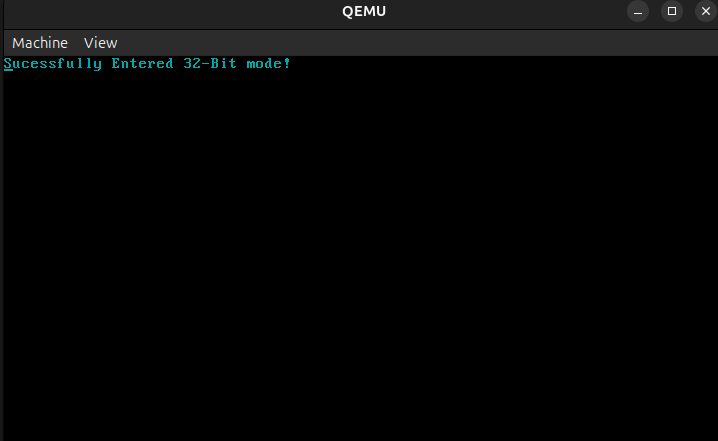

# BASIC BOOTLOADER
This is a basic bootloader, that boots up in the bootsector in 16-bit mode and switches safely to 32-bit mode.

## FUNCTIONALITY
- Implements a simple Global Descriptor Table(GDT)
- Contains a print function that displays text using VGA graphics
- Switches from 16-bit mode to 32-bit mode and prints a success message.

## DEPENDENCIES
- NASM
- QEMU Emulator

